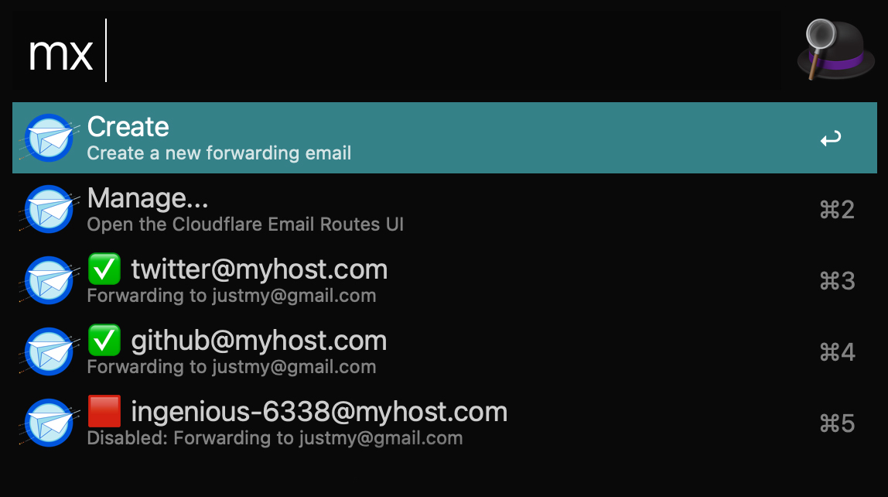
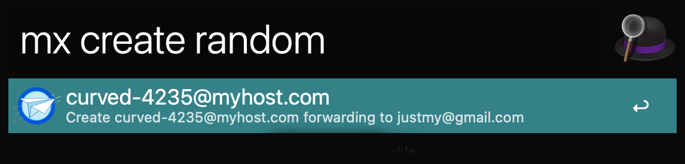

[](https://github.com/dustinblackman/cf-alias/releases)

> Create Cloudflare email alias' directly from your terminal or Alfred.

- [Overview](#Overview)
- [Install](#Install)
  - [Source](#source)
- [Usage](#Usage)
  - [CLI](#cli)
  - [Alfred](#alfred)

## Overview

Create and manage CloudFlare email alias's easily to reduce the barrier in creating unique emails per online account you own. You can list all alias to easily copy to clipboard, create unique alias of your choosing, or generate random ones!

This was done quickly and just for fun, and is using an undocumented Cloudflare API. Bugs are expected!



<!-- command-help start -->

```
cf-alias v0.1.9
CLI interface for Cloudflare Email Routing

USAGE:
    cf-alias <SUBCOMMAND>

OPTIONS:
    -h, --help       Print help information
    -V, --version    Print version information

SUBCOMMANDS:
    alfred        Commands for the Alfred extension
    completion    Generates shell completions
    create        Creates a new forwarding email
    help          Print this message or the help of the given subcommand(s)
    list          List existing email routes.
```

<!-- command-help end -->

## Install

### Source

```sh
git clone https://github.com/dustinblackman/cf-alias.git
cd cf-alias
cargo install --path .
```

## Usage

Create a configuration file in `$HOME/.cf-alias.json` with the following keys. You can find values for each in the
Cloudflare dashboard.

```json
{
  "cloudflare_account_id": "cloudflare-acccount-id-here",
  "cloudflare_forward_email": "mygmail@gmail.com",
  "cloudflare_root_domain": "mydomain.com",
  "cloudflare_token": "cloudflare-api-token",
  "cloudflare_zone": "cloud-zone-id-for-mydomain.com"
}
```

### CLI

- `cf-alias list` to list existing forwarders.
- `cf-alias create --email-prefix github` to create a email fowarder as `github@mydomain.com`
- `cf-alias create --random` to create a randomly generated email forwarder.

### Alfred

Install the Alfred extension by
[downloading](https://github.com/dustinblackman/cf-alias/blob/master/alfred/mx.alfredworkflow?raw=true) the extension, and dragging it in to Alfred to install. Use `mx` as a prefix to bring up all the available commands.


You can create a specific email forwarder with `mx create MY-NAME`.


cf-alias can also generate you a random email forwarder by running `mx create random`.


